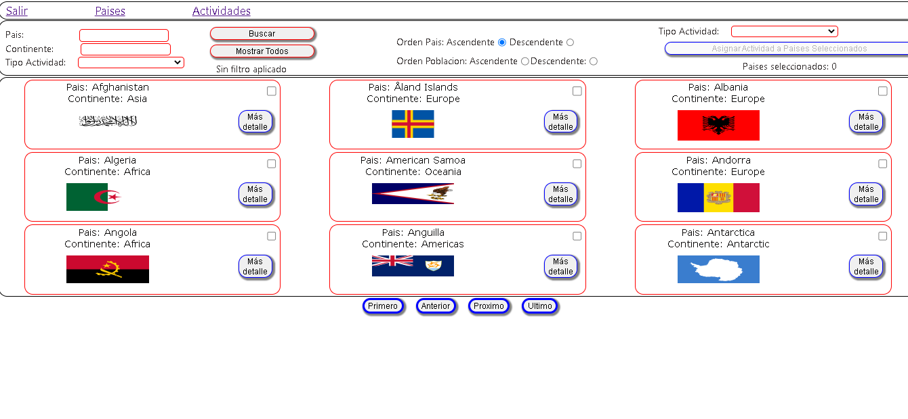

<p align='left'>
    
</p>

# Individual Project - Henry Countries

## Landing Page

<p align="left">
  
</p>

## Home

<p align="left">
  
</p>

## Objetivos del Proyecto

- App utlizando React, Redux, Node y Sequelize.
- Permite consultar informacion de paises consumiendo apis externas de restcountries
- Permite crear actividades turísticas y asiganarlas a paises
- Filtros y ordenamientos en front y back


## BoilerPlate

El boilerplate cuenta con dos carpetas: `api` y `client`. En estas carpetas estará el código del back-end y el front-end respectivamente.

En `api` existe un archivo llamado: `.env` que tenga la siguiente forma:

```
DB_USER=usuariodepostgres
DB_PASSWORD=passwordDePostgres
DB_HOST=localhost
```

Reemplazar `usuariodepostgres` y `passwordDePostgres` con tus propias credenciales para conectarte a postgres. Este archivo va ser ignorado en la subida a github, ya que contiene información sensible (las credenciales).

Adicionalmente será necesario que creen desde psql una base de datos llamada `countries`

El contenido de `client` fue creado usando: Create React App.

## Enunciado

La idea general es crear una aplicación en la cual se pueda ver información de  distintos paises utilizando la api externa [restcountries](https://restcountries.com/) y a partir de ella poder, entre otras cosas:

  - Buscar paises
  - Filtrarlos / Ordenarlos
  - Crear actividades turísticas


### Únicos Endpoints/Flags utilizados

  - GET https://restcountries.com/v3/all
  - GET https://restcountries.com/v3/name/{name}
  - GET https://restcountries.com/v3/alpha/{code}


#### Tecnologías utilizadas:
- [ ] React
- [ ] Redux
- [ ] Express
- [ ] Sequelize - Postgres


